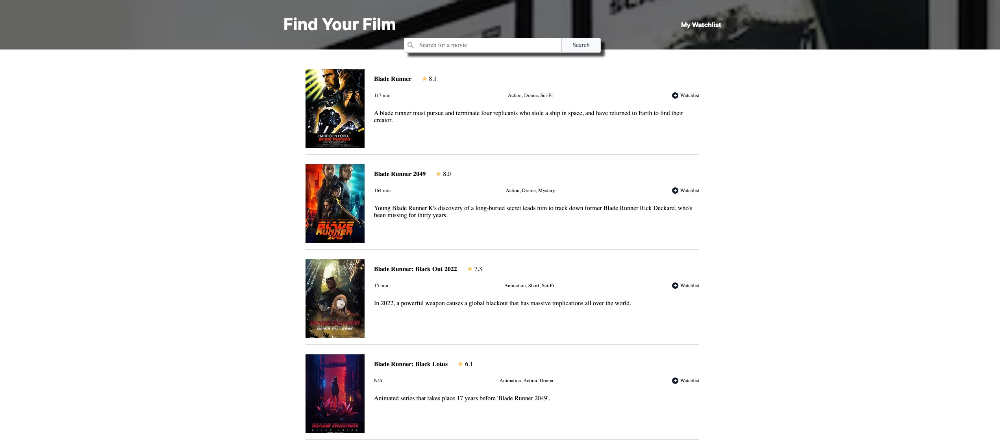

<h1 align="center">Welcome to movie-watchlist 👋</h1>

Search for movies and make a library of your favorite ones using the OMDb API.

## ✨ Demo

    

    <a align="center" href="https://movies-watchlist-solo.netlify.app/">Live Demo</a>

## Author

👤 **Tim DeHof**

- Twitter: [@timdehof](https://twitter.com/timdehof)
- Github: [@timDeHof](https://github.com/timDeHof)

## Show your support

Give a ⭐️ if you like this project!

---

_This README was generated with ❤️ by [readme-md-generator](https://github.com/kefranabg/readme-md-generator)_
